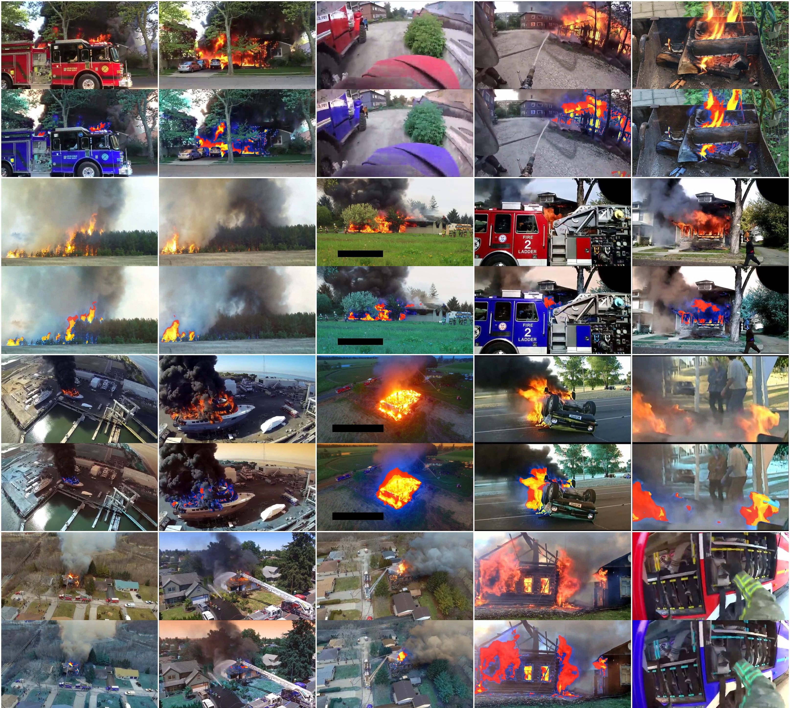
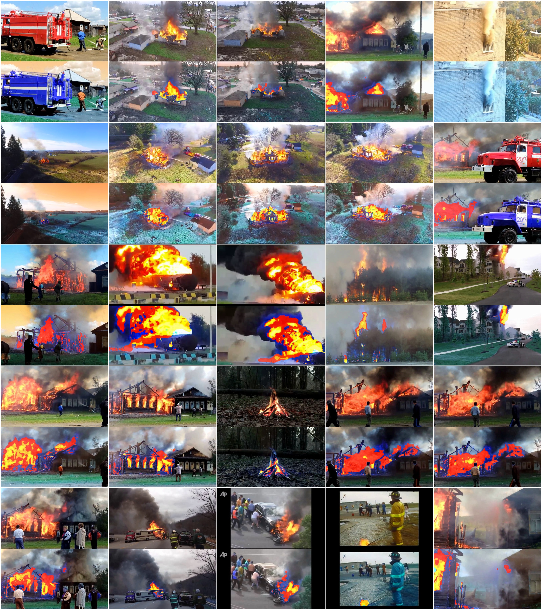

# wUUNet_fireSegm

The PyTorch implementation of wUUNet model designed for multiclass fire segmentation
For more information read the [paper]()

# Installation

The model is tested on Ubuntu 18.04 workstation with NVidia RTX2070

You need to install [cuda](https://developer.nvidia.com/cuda-10.2-download-archive) before installing python packages

`sudo python3 ./setup.py install`

We have collected a custom dataset of 6250 samples.
You can extract it via:

`python3 ./dataset.py`

# Using

In order to train the models run:

`python3 ./train_wuunet.py`

or

`python3 ./train_unet.py`

the parameters of training are hardcoded and you can change them directly in training scripts

In order to use *.ipynb evaluation notebooks run jupyter server, e.g.:

`jupyter notebook`

the source code is reusable for wide range of segmentation tasks as well as extendable
by introducing new CNN models to solve the multiclass fire-segmentation task.

# Optimization

Training and evaluation procedures are tightly coupled with storing to/getting data from Filesystem
since those files are stored into 

`${project_root}/output` 

folder you can increase the perfomance of such tasks
via linking the output directory manually to the appropriate dir located in SSD
e.g.:

`sudo ln -s /ssd/output ${project_root}/output`

# Results

| Model | Binary Jaccard | Multiclass Jaccard |
|-------|:--------------:|:------------------:|
| UNet FS 224 non-int | 87.43 % | 78.26 % |
| UNet FS 224 Gauss   | 87.96 % | 79.15 % |
| UUNet FS 224 Gauss  | 89.92 % | 79.91 % |
| wUUNet FS 224 Gauss | 91.35 % | 80.23 % |

